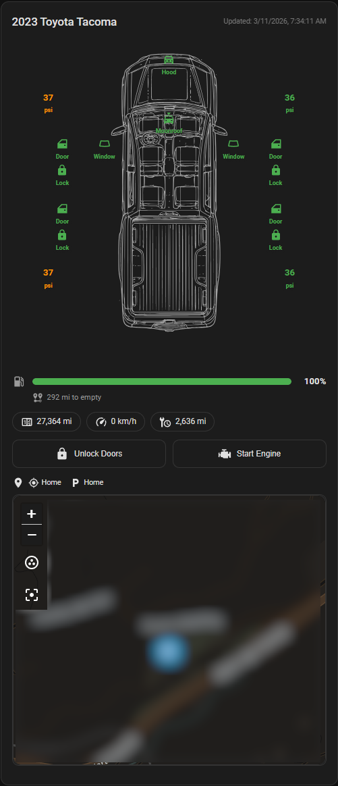

# Toyota Car Card for Home Assistant

[](https://github.com/hacs/integration)
[](https://github.com/YOUR_GITHUB_USER/car-card/releases)

A custom Lovelace card that visualizes vehicle data from the [ha-toyota-na](https://github.com/widewing/ha-toyota-na) integration.



## Features

- **Top-down car SVG** with door/hood/trunk open indicators
- **Fuel level** bar with color coding (green → orange → red)
- **EV battery level** and range (for hybrid/EV vehicles)
- **Tire pressures** displayed in a 2×2 grid with color-coded warnings
- **Door, window, and lock status** with summary badges
- **Odometer**, **speed**, and **next service** info chips
- Optional custom vehicle image
- Built-in visual config editor
- Fully themed — adapts to your HA theme (light/dark)

## Installation

### HACS (Recommended)

1. Open HACS in your Home Assistant instance.
2. Go to **Frontend** → click the **⋮** menu → **Custom repositories**.
3. Add the repository URL (e.g. `https://github.com/ixitxachitl/car-card`) and select category **Dashboard**.
4. Search for "Toyota Car Card" and click **Install**.
5. Refresh your browser (Ctrl+F5).

### Manual

1. Download `toyota-car-card.js` from the [latest release](https://github.com/ixitxachitl/car-card/releases/latest).
2. Copy it into your Home Assistant `config/www/` directory.
3. Add the resource in **Settings → Dashboards → ⋮ → Resources**:
   - URL: `/local/toyota-car-card.js`
   - Type: JavaScript Module
4. Refresh your browser.

## Configuration

Add the card to a dashboard:

```yaml
type: custom:toyota-car-card
title: My Toyota
entity_prefix: "2024_camry"
```

### Finding your `entity_prefix`

The prefix is the suffix shared by all your Toyota sensor entities. For example, if your entities look like:

- `sensor.fuel_level_2024_camry`
- `sensor.odometer_2024_camry`
- `sensor.front_driver_tire_2024_camry`

Then your `entity_prefix` is `2024_camry`.

You can find this in **Settings → Devices & Services → Toyota → Entities**.

### Full Options

| Option          | Type    | Default  | Description                                    |
|-----------------|---------|----------|------------------------------------------------|
| `type`          | string  | required | Must be `custom:toyota-car-card`               |
| `title`         | string  | `Toyota` | Card title                                     |
| `entity_prefix` | string  | required | Entity suffix (e.g. `2024_camry`)              |
| `image_url`     | string  | —        | Custom car image (`/local/car.png` or `https://...`) |
| `show_fuel`     | boolean | `true`   | Show fuel level bar                            |
| `show_odometer` | boolean | `true`   | Show odometer chip                             |
| `show_tires`    | boolean | `true`   | Show tire pressure grid                        |
| `show_doors`    | boolean | `true`   | Show door status                               |
| `show_windows`  | boolean | `true`   | Show window status                             |
| `show_locks`    | boolean | `true`   | Show lock status                               |
| `show_ev`       | boolean | `false`  | Show EV battery/range (for hybrids/EVs)        |
| `show_speed`    | boolean | `false`  | Show current speed                             |
| `show_service`  | boolean | `false`  | Show distance to next service                  |

### Example: Full Config

```yaml
type: custom:toyota-car-card
title: 2024 Camry
entity_prefix: "2024_camry"
image_url: "/local/images/camry.png"
show_fuel: true
show_odometer: true
show_tires: true
show_doors: true
show_windows: true
show_locks: true
show_ev: false
show_speed: true
show_service: true
```

### Example: EV / Hybrid

```yaml
type: custom:toyota-car-card
title: 2024 RAV4 Prime
entity_prefix: "2024_rav4_prime"
show_ev: true
show_fuel: true
```

## Sensors Used

This card reads the following entities from the ha-toyota-na integration:

| Sensor | Entity Pattern |
|--------|---------------|
| Fuel Level | `sensor.fuel_level_{prefix}` |
| Distance to Empty | `sensor.distance_to_empty_{prefix}` |
| Odometer | `sensor.odometer_{prefix}` |
| Speed | `sensor.speed_{prefix}` |
| Next Service | `sensor.next_service_{prefix}` |
| Last Update | `sensor.last_update_timestamp_{prefix}` |
| Front Driver Tire | `sensor.front_driver_tire_{prefix}` |
| Front Passenger Tire | `sensor.front_passenger_tire_{prefix}` |
| Rear Driver Tire | `sensor.rear_driver_tire_{prefix}` |
| Rear Passenger Tire | `sensor.rear_passenger_tire_{prefix}` |
| EV Battery Level | `sensor.ev_battery_level_{prefix}` |
| EV Range | `sensor.ev_range_{prefix}` |
| Doors (FL,FR,RL,RR) | `binary_sensor.{position}_door_{prefix}` |
| Windows (FL,FR,RL,RR) | `binary_sensor.{position}_window_{prefix}` |
| Door Locks | `binary_sensor.{position}_door_lock_{prefix}` |
| Hood | `binary_sensor.hood_{prefix}` |
| Trunk | `binary_sensor.trunk_{prefix}` |
| Moonroof | `binary_sensor.moonroof_{prefix}` |

## License

MIT
